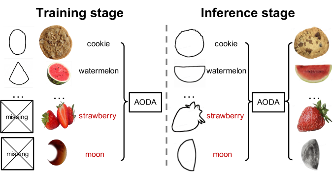
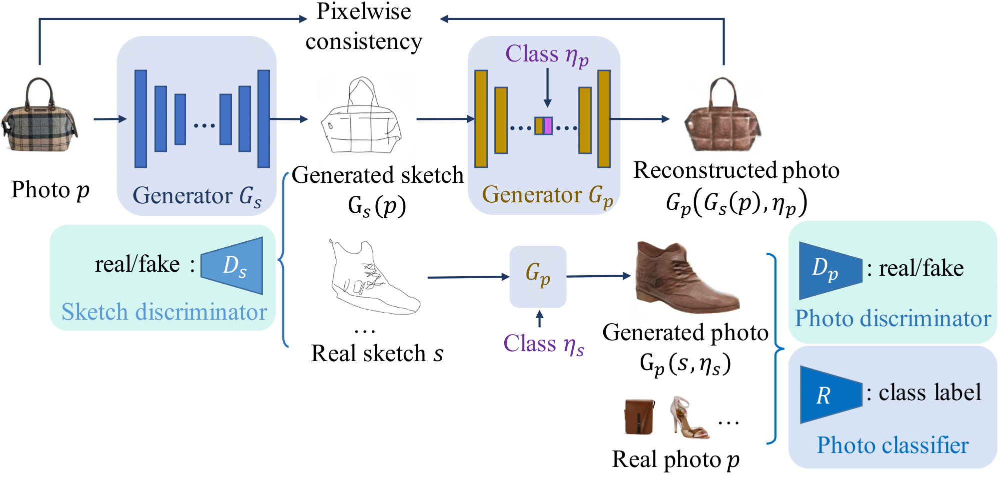

# AODA

By [Xiaoyu Xiang](https://engineering.purdue.edu/people/xiaoyu.xiang.1), [Ding Liu](https://scholar.google.com/citations?user=PGtHUI0AAAAJ), [Xiao Yang](https://scholar.google.com/citations?user=_MAKSLkAAAAJ&hl=en), [Yiheng Zhu](https://www.etc.cmu.edu/blog/author/yihengz/), [Xiaohui Shen](https://xiaohuishen.github.io/), [Jan P. Allebach](https://engineering.purdue.edu/~allebach/)

This is the official Pytorch implementation of _Adversarial Open Domain Adaptation for Sketch-to-Photo Synthesis_.

#### [Paper](https://arxiv.org/abs/2104.05703) | [10-min Video (10 min)](https://www.youtube.com/watch?v=9PUO55s4kRQ) | [5-min Video](https://www.bilibili.com/video/BV1DY411x7Pu)



## Updates

- **Our paper will be presented on WACV-2022 on Jan 5, 19:30 pm GMT-10. Welcome to come and ask questions!**
- 2021.12.25: Upload all codes. Merry Christmas!
- 2021.12.21: Update the LICENSE and repo contents.
- 2021.4.15: Create the repo

## Contents

0. [Introduction](#introduction)
1. [Prerequisites](#Prerequisites)
2. [Get Started](#Get-Started)
   - [Installation](#Installation)
   - [Data Preparation](#data-preparation)
   - [Training](#Training)
   - [Testing](#Testing)
3. [Contact](#Contact)
4. [License](#License)
5. [Citations](#citations)
6. [Acknowledgments](#Acknowledgments)

## Introduction

The repository contains the entire project (including all the util scripts) for our open domain sketch-to-photo synthesis network, AODA.

AODA aims to synthesize a realistic photo from a freehand sketch with its class label, even if the sketches of that class are missing in the training data. It is accepted by [WACV-2022](https://wacv2022.thecvf.com/home) and [CVPR Workshop-2021](https://l2id.github.io/). The most updated paper with supplementary materials can be found at [arXiv](https://arxiv.org/abs/2104.05703).

In AODA, we propose a simple yet effective open-domain sampling and optimization strategy to "fool" the generator into treating fake sketches as real ones. To achieve this goal, we adopt a framework that jointly learns sketch-to-photo and photo-to-sketch generation. Our approach shows impressive results in synthesizing realistic color, texture, and maintaining the geometric composition for various categories of open-domain sketches.

If our proposed architectures also help your research, please consider [citing our paper](#Citations).



## Prerequisites

- Linux or macOS
- Python 3 (Recommend to use [Anaconda](https://www.anaconda.com/download/#linux))
- CPU or NVIDIA GPU + CUDA CuDNN

## Get Started

### Installation

First, clone this repository:

```Shell
git clone https://github.com/Mukosame/AODA.git
```

Install the required packages: `pip install -r requirements.txt`.

### Data Preparation

There are three datasets used in this paper: Scribble, SketchyCOCO, and QMUL-Sketch:

**Scribble**:

```Shell
wget -N "http://www.robots.ox.ac.uk/~arnabg/scribble_dataset.zip"
```

**SketchyCOCO**:

Download from [Google Drive](https://drive.google.com/file/d/1P2kb1SCqnZrK_P32Vmcf5FShjbC9kN7e/view).

**QMUL-Sketch**:

This dataset includes three datasets: handbags with 400 photos and sketches, ShoeV2 with 2000 photos and 6648 sketches, and ChairV2 with 400 photos and 1297 sketches. The complete dataset can be downloaded through [Google Drive](https://drive.google.com/file/d/18jWDOUr5zfFQphLzAxeWx0H50GigZ7l3/view?usp=sharing).

### Training

Train an AODA model:

```Shell
python train.py --dataroot ./dataset/scribble_10class_open/ \
                --name scribble_aoda \
                --model aoda_gan \
                --gan_mode vanilla \
                --no_dropout \
                --n_classes 10 \
                --direction BtoA \
                --load_size 260
```

After training, your models `models/latest_net_G_A.pth`, `models/latest_net_G_B.pth` and its training states `states/latest.state`, and a corresponding log file `train_scribble_aoda_xxx` are placed in the directory of `./checkpoints/scribble_aoda/`.

### Testing

Please download the weights from [GoogleDrive], and put it into the [weights/](weights/) folder.

You can switch the `--model_suffix` to control the direction of sketch-to-photo or photo-to-sketch synthesis. For different datasets, you need to change the `--name` and the corresponding `--n_classes`:

```Shell
python test.py --model_suffix _B --dataroot ./dataset/scribble/testA --name scribble_aoda --model test --phase test --no_dropout --n_classes 10
```

Your test results will be saved at `./results/test_latest/`.

## Contact

[Xiaoyu Xiang](https://engineering.purdue.edu/people/xiaoyu.xiang.1).

You can also leave your questions as issues in the repository. I will be glad to answer them!

## License

This project is released under the [BSD-3 Clause License](LICENSE).

## Citations

```BibTex
@inproceedings{xiang2022adversarial,
  title={Adversarial Open Domain Adaptation for Sketch-to-Photo Synthesis},
  author={Xiang, Xiaoyu and Liu, Ding and Yang, Xiao and Zhu, Yiheng and Shen, Xiaohui and Allebach, Jan P},
  booktitle={Proceedings of the IEEE/CVF Winter Conference on Applications of Computer Vision},
  year={2022}
}
```

## Acknowledgments

This project is based on the [CycleGAN PyTorch](https://github.com/junyanz/pytorch-CycleGAN-and-pix2pix).
